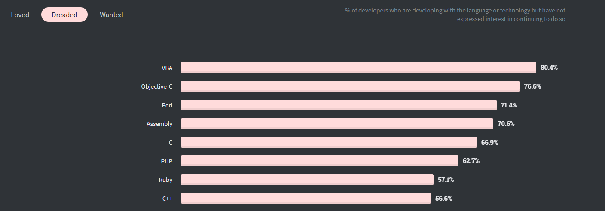

# Why is VBA the most dreaded language?

In the 2020 StackOverflow survey, it is claimed that VBA is the most dreaded language:



In this article we will explore some of the reasons why this might be the case.

## Who uses VBA?

In order to answer this question we must first look at another question - who actually uses VBA in the first place? In 2021 I ran a poll on [/r/vba](http://reddit.com/r/vba) where I asked redditors why they code in VBA.


From these data we can clearly see that the majority of people who use VBA do so mainly because they have no other choice. Many organisations run their entire business processes with Excel and when a little bit of automation is required VBA is usually \#1 on the list because it's something that IT departments haven't locked down and haven't provided a better alternative for. In business culture IT rarely will allow it's users to even create and query a database. This leads to even more data being trapped in Excel.

In the business I currently work for, in the engineering division, we have access to a variety of technologies:

* OnPrem - PowerShell (No access to `Install-Module`)
* OnPrem - Excel (VBA  / OfficeJS (limited access) / OfficeScripts / PowerQuery)
* OnPrem - PowerBI Desktop
* OnCloud - Power Platform (PowerApps, Power BI, PowerAutomate (non-premium only))
* OnCloud - Sharepoint
* SandboxedServer - ArcGIS (ArcPy)
* SandboxedServer - MapInfo (MapBasic)
* SandboxedServer - InfoWorks ICM (Ruby)
* SandboxedCloud - ArcGIS Online

Every request for a high level language to be installed across the team e.g. `Python` / `Ruby` etc. has been rejected by CyberSecurity in favour for technologies like `PowerAutomate`, `PowerApps` etc. It is supposedly "Against the strategic vision of the company". Why are these technologies unworkable? That's a bigger topic [for another day](/articles/Issues%20with%20PowerPlatform.html), but suffice to say sometimes the requirement is either `OnPrem`, or the task is so large a serverless PowerAutomate approach is too slow, or the algorithm so complex that a PowerAutomate solution would become infuriating to maintain and incomprehensible to even IT folks \(e.g. see [projection algorithms](https://www.movable-type.co.uk/scripts/latlong-os-gridref.html#source-code-osgridref)\).

Next, in 2022 I ran another poll on `/r/vba` where I asked redditors how they learned VBA. This was their responses:


I echo the sentiment of most users of VBA here. I was also self-taught, but was fortunate enough to have learnt Lua before learning VBA, and have friends studying computer science, so I adopted many of their best practices. Many people who are self-taught are unlikely to know or have these best practices in mind. Looking at a [recent poll of mine](https://www.reddit.com/r/vba/comments/16ky8ja/do_you_know_or_write_code_in_other_programming), about 1/3 of respondents had not used other languages and therefore are unlikely to follow best practices.

## The state of VBA projects

Now that we've understood the users, we have to contemplate what state existing VBA projects are in. This can very dramatically from project  to project, and largely dependent on the authors of the project in question.


### Poor indentation

Many people who write VBA code indent nothing.

```vb
Sub FindCombination()
Dim numArray() As Variant
Dim total As Double
Dim result As String
Dim i As Long, j As Long, k As Long, n As Long
numArray = Range("A1:A10").Value
total = 25
if range("A1") = Empty then total = 50
For i = 1 To 2 ^ UBound(numArray, 1)
result = ""
n = 0
For j = 0 To UBound(numArray, 1)
If i And 2 ^ j Then
result = result & numArray(j + 1, 1) & "+"
n = n + numArray(j + 1, 1)
End If
Next j
If n = total Then
Range("A1") = Left(result, Len(result) - 1)
End If
Next i
End Sub
```

Some only use 1 layer of indentation:

```vb
Sub FindCombination()
    Dim numArray() As Variant
    Dim total As Double
    Dim result As String
    Dim i As Long, j As Long, k As Long, n As Long
    numArray = Range("A1:A10").Value
    total = 25
    if range("A1") = Empty then total = 50
    For i = 1 To 2 ^ UBound(numArray, 1)
    result = ""
    n = 0
    For j = 0 To UBound(numArray, 1)
    If i And 2 ^ j Then
    result = result & numArray(j + 1, 1) & "+"
    n = n + numArray(j + 1, 1)
    End If
    Next j
    If n = total Then
    Range("A1") = Left(result, Len(result) - 1)
    End If
    Next i
End Sub
```

or sometimes the indenation is all over the shop...

```vb
Public Sub GradientCol(Ob As Object, AB As Single, R1 As Single, G1 As Single, B1 As Single, R2%, G2%, B2%)
On Error Resume Next 'just in case
Dim H%, rt As Single, Gt As Single, Bt As Single
Imagewait True
AB = AB / 10 'alpha blending
H = Ob.Height - 1
rt = (R2 - R1) / H
Gt = (G2 - G1) / H
Bt = (B2 - B1) / H
'Set the gradient
For xx = 0 To H
Ob.Line (0, xx)-(Ob.Width - 1, xx), RGB(R1, G1, B1)
R1 = R1 + rt
G1 = G1 + Gt
B1 = B1 + Bt
Next xx
'Read the gradient-colors, mix the with alpha-blend
'and put the new colors back.
For xx = 0 To Ob.Width - 1
For yy = 0 To Ob.Height - 1
    Color = GetPixel(Ob.hdc, xx, yy)
    R1 = Color Mod 256&
    G1 = ((Color And &HFF00) / 256&) Mod 256&
    B1 = (Color And &HFF0000) / 65536
'This is the actual alpha-blending
        R(xx, yy) = (R(xx, yy) * (1 - AB)) + (R1 * AB)
        G(xx, yy) = (G(xx, yy) * (1 - AB)) + (G1 * AB)
        B(xx, yy) = (B(xx, yy) * (1 - AB)) + (B1 * AB)
'put the new colors back
SetPixel Ob.hdc, xx, yy, RGB(R(xx, yy), G(xx, yy), B(xx, yy))
Next yy, xx
Imagewait False
Ob.Refresh
End Sub
```

If you're lucky you'll have code which is indented well. But this is quite often a rarity among VBA developers. 

### Poor Commentary

Many many vba macro authors will write 0 commentary. This is quite alright if the code is clean, but most code written is not. And just like in many modern languages many programmers do not write adequate commentary on either how to use the code or how the internals work. This is definitely not isolated to a VBA problem, but the lack of skilled programmers writing VBA code often exacerbates this problem.

### Macro recorder junk

Because many VBA devs learn from the macro recorder they also often will leave recorded VBA in the subs. This VBA is notoriously awful, with many unrequired statements which is often totally unoptimised to the task at hand. For instance the below code:

```vb
Sub Macro1()
    Range("A1:A20").Select
    Selection.Copy
    ActiveWindow.SmallScroll Down:=8
    Sheets.Add After:=ActiveSheet
    ActiveWindow.SmallScroll Down:=7
    ActiveSheet.Paste
    Range("A2").Select
    Selection.End(xlDown).Select
    ActiveWindow.SmallScroll Down:=18

    Columns("A:A").Select
    Selection.Style = "Percent"
End Sub
```

Should really be more like this:

```vb
    Sub Macro1()
        With sheets.add()
            With .Range("A1:A20")
                .value = Sheet1.Range("A1:A20").value
                .Style = "Percent"
            End With
        End with
    End sub
```

The reality is that the macro recorder can work relatively, across many different workbooks (Excel spreadsheets). This does have benefits like being able to record pretty much anything, but it does mean that you get these awful "Select the range, then apply to the selection" macro commands. Later macro recorders like OfficeScripts don't have the ability to work across multiple spreadsheets alleviating the need for a recorder which does this, but as a result OfficeScripts does become less powerful.

Another issue that vba projects which have used the macro recorder have is that quite often a mix of formulae and code will be used, and sometimes it's not clear why they used formulae, and why they used VBA.

```vb
Range("A2").Select
ActiveCell.Formula = _
    "=INDEX('Raw Data'!$A$1:$CC$67,ROWS($A$2:A2)+1,MATCH(A$1,'Raw Data'!$1:$1,0))"
Range("A2").Select
Selection.AutoFill Destination:=Range("A2:A67")
Range("B2").Select
ActiveCell.FormulaR1C1 = _
    "=IF((ISERROR(INDEX('Raw Data'!R1C1:R67C81,MATCH(RC1,'Raw Data'!C1,0),MATCH('Dynamic Summary'!R1C,'Raw Data'!R1,0)))),""-"",INDEX('Raw Data'!R1C1:R67C81,MATCH(RC1,'Raw Data'!C1,0),MATCH('Dynamic Summary'!R1C,'Raw Data'!R1,0)))"
'ActiveCell.FormulaR1C1 = _
'    "=INDEX('Raw Data'!R1C1:R67C81,MATCH(RC1,'Raw Data'!C1,0),MATCH('Dynamic Summary'!R1C,'Raw Data'!R1,0))"
Range("B2").Select
Selection.AutoFill Destination:=Range("B2:B67"), Type:=xlFillDefault
Range("B2:B67").Select
Selection.AutoFill Destination:=Range("B2:K67"), Type:=xlFillDefault
Range("A2:K67").Select
Selection.NumberFormat = "General"
Columns("E:F").Select
'Selection.Style = "Currency"
Columns("G:G").Select
Selection.Style = "Percent"
Columns("H:I").Select
Selection.Style = "Comma"
Columns("K:K").Select
Selection.Style = "Percent"

Sheets("Raw Data").Select
Range("CombinedRawData[[#Headers],[Project ID (PID)]]").Select
Range(Selection, Selection.End(xlDown)).Select
Range(Selection, Selection.End(xlToRight)).Select
Application.CutCopyMode = False
Selection.Copy
Range("CombinedRawData[[#Headers],[Project ID (PID)]]").Select
Selection.PasteSpecial Paste:=xlPasteValues, Operation:=xlNone, SkipBlanks _
    :=False, Transpose:=False
Sheets("PMO Tracked CIAC Projects").Select
Application.CutCopyMode = False
'ActiveWindow.SelectedSheets.Delete
'Sheets("PIDHealthData").Select
'ActiveWindow.SelectedSheets.Delete
```

### Poor seperation of concerns

It is quite common for VBA applications to have monolithic subs instead of seperating code into many smaller functions or objects each with a seperate concern. This again comes mostly from the lack of programming knowledge and experience. Also its' very common that VBA developers will use global variables, or module level variables all the way throughout their code, sometimes not declaring them, all of which produces unexpected behaviour and difficult to maintain code. 

### Poor adherence to DRY

A best practice in programming is D.R.Y i.e. "Don't repeat yourself". However due to the naivity of many VBA developers, there is a lot of repeated code. Often the same piece of code will be copy and pasted all over the code base instead of modularising this code in a seperate function / library.

```vb
if Range("A1").value = "OK" then
  Debug.Print Range("B1")
  ...
end if
if Range("A2").value = "OK" then
  Debug.Print Range("B2")
  ...
end if
if Range("A3").value = "OK" then
  Debug.Print Range("B3")
  ...
end if
if Range("A4").value = "OK" then
  Debug.Print Range("B4")
  ...
end if
...
```

### Poor numerical reasoning

Not all developers have good mathematical skills, but most do. However most people who use VBA i.e. those who "make macros" are typically not the best when it comes to mathematics and numerical reasoning. This can lead to overcomplicated or unscalable solutions to problems. Below I've given a few examples of this which I've experienced in the past.

#### Finding generalised numerical shortcuts

One example I've come across is in finding the [AMP number](https://en.wikipedia.org/wiki/Asset_management_plan_period) for a given date - An asset management plan (AMP) period is a five-year time period used in the English and Welsh water industry. The first AMP, AMP1, was the period of time between April 1990 and 1995. The AMP is commonly used in databases as a means of aggregating data. In a lot of code I've seen engineers use something along the lines of this:

```vb
Function getAmp(ByVal dt as Date) as Long
  select case dt
    case Is < DateSerial(1990,3,1): getAmp = 0
    case Is < DateSerial(1995,3,1): getAmp = 1
    case Is < DateSerial(2000,3,1): getAmp = 2
    case Is < DateSerial(2005,3,1): getAmp = 3
    case Is < DateSerial(2010,3,1): getAmp = 4
    case Is < DateSerial(2015,3,1): getAmp = 5
    case Is < DateSerial(2020,3,1): getAmp = 6
    case Is < DateSerial(2025,3,1): getAmp = 7
  end select
End Function
```

And ultimately the code needs to be modified every 5 years to include an additional AMP number. Of course the better approach would be the following, which will continue working on into the future without modification:

```vb
Function getAmp(ByVal dt As Date) As Long
  getAmp = floor((Year(dt - 90) - 1990) / 5)
End Function
Function floor(ByVal x As Double) As Double
  floor = Int(x) - 1 * (Int(x) > x)
End Function
```

#### Use of numerical methods when generalised formula can be found

In a carbon assessment tool, there was a function which approximated how much carbon a tree would consume at an instance of time. Let's say `1/(x+1)` for the sake of argument. In order to calculate the total amount of carbon within a time frame the engineers had used an iterative approach as follows:

```vb
function getTotalCarbon(ByVal iNumYears as Long) as Double
    Dim sumCarbon as Double: sumCarbon = 0
    Dim i as long, j as long
    For i = 0 to iNumYears - 1
        For j = 1 to 100
            Dim x as Double: x = i + 1/100
            sumCarbon = sumCarbon + 1/(x+1) * 1/100
        next
    next
    getTotalCarbon = sumCarbon
end function
```

However this produces a poor estimate. Those with a little more mathematical know how will see this is simply integrating the expression, and thus the better approach would be to integrate `1/(x+1)` to `log(x+1)` and then plug values (also note `log(1)==0`):

```vb
function getTotalCarbon(ByVal iNumYears as Long) as Double
    getTotalCarbon = log(iNumYears)
end function
```

### Poor choice of algorithms

Finally a very common issue with many VBA projects is use of poor, slow algorithms or datastructures. For instance it is very common for people to use an array to store a list of items as follows:

```vb
Dim o() as object
Redim o(0 to 0)
For each row in rows
    if row("col") = condition then
        set o(ubound(o)) = row
        Redim Preserve o(ubound(o)+1)
    end if
next
```

The above, where we are inserting an element into an array is `O(n^2)`, where as a more optimal example would be using a collection, where adding additional items is `O(1)`:

```vb
Dim o as collection
For each row in rows
    if row("col") = condition then
        o.add row
    end if
next
```

It is also extremely common for people to use funky algorithms due to the lack of available data structures / libraries in VBA. 

## Why is VBA the most dreaded language?

The fact is that most modern developer's experience with VBA will likely be a declaration from the business that an old VBA tool needs to be re-written in a modern language as part of a business application. As such they will be given a project which likely has janky syntax, with awful indentation, no comments, and super old fashioned low level datastructures, that actually trying to make sense of the application in order to rebuild it is an utter nightmare. So it's not really that the language as a whole is dreaded, but that applications built in VBA are dreaded.

[VBA does have it's issues](./Issues%20with%20VBA.html) and these may also be contributing factors, but my personal opinion is that most developers who dread VBA mostly just have bad experiences trying to port poorly written VBA applications to other platforms. VBA in of itself is not an awful language, and it's basis in [COM](https://en.wikipedia.org/wiki/Component_Object_Model) is, dare I say, revolutionary! Most people do have a misunderstanding of COM, and many modern languages don't make working with COM particularly easy. It is quite often seen as a dark art! However COM, as a technology, is still used to this day by [modern Microsoft frameworks](https://en.wikipedia.org/wiki/Windows_Runtime) and is one of those technologies which people keep coming back to because it's so powerful. 

> Note: Of course, this is my personal beliefs as to why VBA is dreaded, and we can never really know the real reasons.